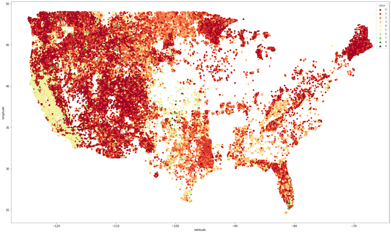
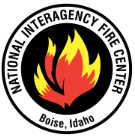
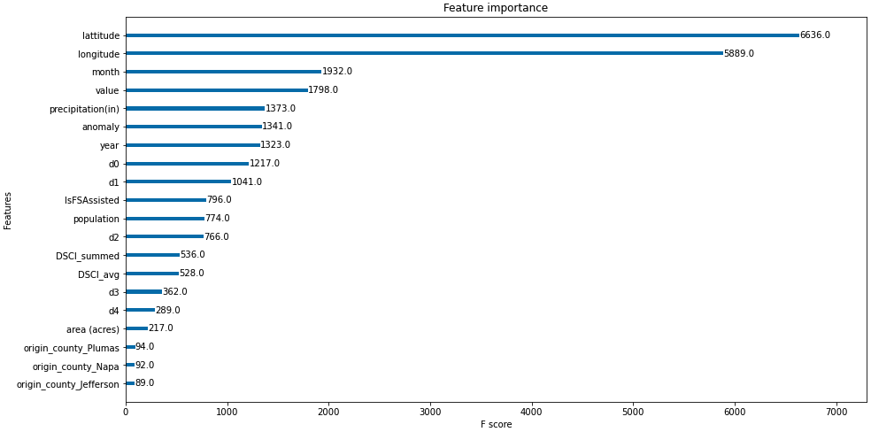
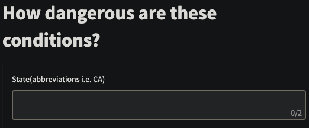

# WildFire Severity
## Executive Summary
In this project, we attempt to predict the severity of a forest fire given a set of conditions in an effort to assist communities and fire fighting services an opportunity to better prepare for a potentially large fire. The research and modeling done here was done for the United States. 
First, significant research was done to identify contribuing factors to forest fires. From there we set out to collect our data which can be observed below. Using the data gathered and knowledge gained through our research, we were able to build a model that predicts how large a forest fire would be if it happend with approx 68% accuracy and F1 Score (macro) of 72%. Considering the baseline percentage to beat was 33%, this model provides a considerable advantage to those who choose to leverage it's predicting power.
 

--- 
## Problem Statement
Wildfires are a serious problem faced by communities around the country. In 2021 there were over 50,000 wildfires nationwide (U.S. Wildfire Statistics | Bankrate). Due to the effects of climate change wildfires will only get worse.

    
*Figure 1: Visualization we found in our EDA process that can be found in our notebook.*

As citizens against climate change, we as a team want to identify and predict how severe a fire will be based on a variety of factors. By predicting areas at risk for severe fire, we can give these communities time to prepare and take preventative measures. Some of the considerations that we want to include when predicting these communities of vulnerability are their temperature, precipitation, drought, and location.

The people we hope to provide access to this tool are the forest service department, fire agencies such as the National Interagency Fire Center, and even the average citizen looking to prepare for fire seasons in the US. 

#   
*Figures 2-4: Images representing communities this model and tool serve.*
 

  ## Data Sources (Data Dictionary posted at the end)
  - <a href="https://data-nifc.opendata.arcgis.com/datasets/nifc::wfigs-wildland-fire-locations-full-history/about" target="_blank">Fire</a>
  - <a href="https://smoosavi.org/datasets/lstw" target="_blank">Weather</a>
  - <a href="https://droughtmonitor.unl.edu/CurrentMap.aspx" target="_blank">Drought</a>
  - <a href="https://www.icip.iastate.edu/tables/population/states-estimates" target="_blank">Population</a>

 

---
## Modeling 
There were a variety of different models and approaches when dealing with the imbalanced classes. The variety of classifier models that were evaluated were Knn, Random Forest, XGBoost, Gradient Boosting, Adaboosting, and several Neural Nets. 

Ultimately after many iterations the model that performed best based on the F1 Score(macro), since we had a multiclass target with severly imbalanced classes of fire severity was the XGBoost model with only minor alterations to the default parameters performed best. The feature importances were explored to determine the ideal app inputs. The barplot below shows those most important features. 

*Figure 5: Feature Importances from XGBoost notebook in Code/Models folder*

---
## Streamlit App 
Based on the best performing model feature importances we created a Streamlit App accesible to the public that is essentially a form that takes in the most valuable and reasonable features weighed most valuable in the XGBoost model. This was intentional because we wanted the users to power to accurately to predict the fire class intensity. The app can be accessed [here](https://share.streamlit.io/jesselyenriquez/fire_severity-xgboost-neural_net-randomforest-/streamlit.py) and it is hosted on a seperate github [here](https://github.com/JesselyEnriquez/Fire_Severity-xgboost-neural_net-randomforest-) with a description of how to run locally here. 

#  
*Figure 6: Form display for Streamlit App.*

The inputs that we selected were important were location, temperature, precipitation, and drought coniditions all of which will need to be approximated on a monthly level. So links and instructions of how to find these values to input are described in the form itself.  

Important notes about the app:
- Values inputed are approximates of a monthly level value
- Drought condition statistics are not released on a monthly level (approximations are described on the form)
- During testing class size 5 appears to be the greatest class size our model could predict 
- Estimates for the remaining model inputs are 0 likely the cause of limited class size predicitnos

 

---

## Conclusion 
The final model is able to predict fire class far more effectively than the baseline. The factors that seem to have the most impact on fire class are  location, time, and weather conditions (temperature, drought conditions, etc).   
Forest services, state and local governments, and concerned citizens can use our model and tool to assess whether they are at risk for a severe fire using our streamlit app. They can then use the results to prepare knowing that they could be dealing with a major fire.
 
---

## Future Work
There are numerous possibilities to expand this project but some important ones would be to create more automated backend calculations to our streamlit app so that a class size greater then 5 can be predicted while ensuring the users are not overwhelmed with the need to make many inputs. 

Integrating an interactive dashboard so folks could see how this tool and model were created. Implementing a time series component to create actual future predictions of how we expected these fire events to change in the near future. 

Finally, creating a seperate model that first predicts the probability of a fire occuring that can be utilized beforehand so that it is a full scope tool.

 ---
 ## Data Dictionary

|Feature|Type|Description|
  |---|---|---|
  |Unique Fire Identifier|Object|	Unique identifier assigned to each wildland fire.  yyyy = calendar year, SSUUUU = POO protecting unit identifier (5 or 6 characters), xxxxxx = local incident identifier (6 to 10 characters) |
  |Lattitude|Object|lattitude coordinates for the fire incident|
  |Longitude|Object|longitude coordinates for the fire incident|
  |Fire Cause|Object|Broad classification of the reason the fire occurred identified as human, natural or unknown. |
  |State|Object|Abbreviation of the state where fire originated|
  |Origin County|Object|	The County Name identifying the county or equivalent entity at point of origin designated at the time of collection.|
  |Acres Burned|float64|	A measure of acres reported for a fire.  More specifically, the number of acres within the current perimeter of a specific, individual incident, including unburned and unburnable islands.  The minimum size must be 0.1.
  |Incident Name|Object|The name assigned to an incident|
  |IsFSAssisted|Object|Indicates if the Forest Service provided assistance on an incident outside their jurisdiction.|
  |Year|float64|Calendar year that the fire originated in|
  |Month|float64|Calendar month that the fire originated in|
  |Value|float64|The average temperature for the state and month|
  |Anomaly|float64|The average difference of the value compared to the historical average|
  |Area (acres) |float64|Area (in acres) of the State|
  |Population |float64|Population of the State | 
  |D0|float64|Drought Intensity - Abnormally Dry|
  |D1|float64|Drought Intensity - Moderate Drought|
  |D2|float64|Drought Intensity - Severe Drought|
  |D3|float64|Drought Intensity - Extreme Drought|
  |D4|float64|Drought Intensity - Exceptional Drought|
  |DSCI summed|float64|The sum of D0-D4|
  |DSCI avg|float64|The weighted average of D0-D4 (calculation reference)|
  |Precipitation (in)|float64|Avergae rainfall in inches for that State and month|
  